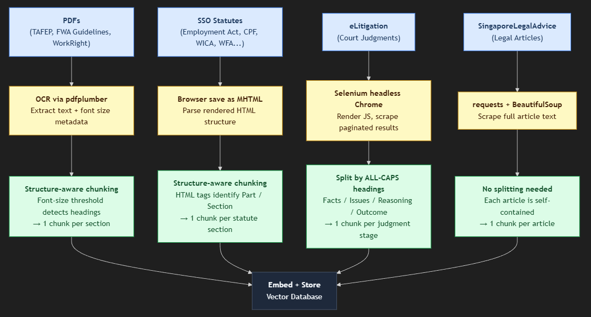
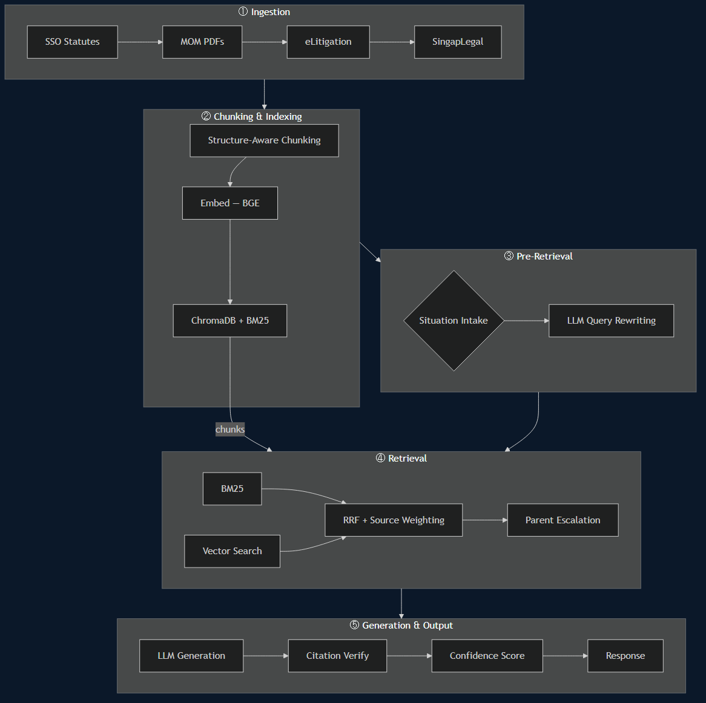

# Singapore Employment Law Chatbot

A RAG (Retrieval-Augmented Generation) chatbot that answers questions about Singapore employment law, grounded in Singapore statutes, MOM guidelines, Tripartite advisories, and court judgments. Powered by OpenAI (`gpt-4o-mini`) and a locally-built vector index.

## Demo

Ask questions like:
- *"My boss fired me without notice after 3 years. What are my rights?"*
- *"How many days of annual leave am I entitled to?"*
- *"My salary hasn't been paid for 2 months. What can I do?"*
- *"What are my rights under the Workplace Fairness Act?"*
- *"Can my employer deny my flexible work arrangement request?"*

## Features

- **Hybrid search** — BM25 keyword + semantic vector search fused via Reciprocal Rank Fusion (RRF); catches both exact legal terms and paraphrased questions
- **Weighted retrieval** — source-type multipliers (statute / guideline / case) applied post-RRF to calibrate result mix against corpus composition
- **Topic-boosted retrieval** — query matched against domain keywords (workplace safety, FWA, PDPA, etc.) to sharpen search terms before retrieval
- **LLM query rewriting** — vague questions converted to precise legal terms before retrieval
- **Structure-aware chunking** — statutes chunked by section; PDFs chunked by detected headings (font size or ALL-CAPS patterns); preserves legal document hierarchy
- **Parent-document retrieval** — matched sub-chunks escalated to full article/section context for richer answers
- **Citation verification** — hallucinated act/section citations flagged automatically after generation
- **WFA grace period notices** — programmatic disclaimer appended whenever Workplace Fairness Act sections are cited
- **Conversation memory** — last 6 turns kept in context so follow-up questions work naturally

- **Clarifying follow-up questions (Situation Intake)** — dynamically identifies missing user-specific variables (e.g. salary, job type, employment duration) and conditionally prompts for them only when they materially affect legal outcomes, ensuring context-aware and legally accurate responses

- **User role adaptation** — supports role-based responses (General Public, Student, HR Staff, Lawyer), dynamically adjusting explanation depth, terminology, and legal precision through prompt conditioning

- **Confidence scoring** — computes a structured confidence score for each response based on:
  - Retrieval quality (RRF score)
  - Source-type diversity (statutes, guidelines, cases)
  - Answer completeness
  - Citation verification results

## Data Collection



## Knowledge Base

| Source | Chunks | Content |
|--------|--------|---------|
| Employment Act 1968 | 154 | All 154 enacted sections with full statutory text |
| CPF Act | 154 | CPF contribution and withdrawal obligations |
| Child Development Co-Savings Act | 51 | Maternity/paternity leave provisions |
| Work Injury Compensation Act | 111 | Workplace injury claims and compensation |
| Retirement and Re-employment Act | 23 | Retirement age and re-employment obligations |
| Workplace Safety and Health Act | 73 | Workplace safety duties and offences |
| Personal Data Protection Act | 86 | Employee data handling obligations |
| Employment of Foreign Manpower Act | 51 | Foreign worker pass conditions |
| Workplace Fairness Act | 46 | Anti-discrimination provisions (grace period until 2027) |
| Industrial Relations Act | 109 | Union and collective bargaining rights |
| TAFEP Tripartite Standards | 9 | Fair employment practice guidelines |
| FWA Tripartite Guidelines | 15 | Flexible work arrangement request/response rules |
| MOM WorkRight Guide | 8 | MOM plain-English guide to employment rights |
| SingaporeLegalAdvice.com | 66 | Plain-English employment law articles |
| eLitigation court judgments | 97 | ECT and High Court employment cases |
| **Total** | **1,053** | |


**Sources:**
- https://sso.agc.gov.sg (all statutes)
- https://www.tal.sg/tafep/employment-practices/tripartite-standards
- https://www.mom.gov.sg (WorkRight Guide, FWA Guidelines)
- https://singaporelegaladvice.com/law-articles/employment-law/
- https://www.elitigation.sg


## System




## Setup

### Prerequisites

- Python 3.10 or higher
- OpenAI API key
- ~2GB free disk space (vector index)

### Step 1 — Clone the repo

```bash
git clone <repo-url>
cd LLM-Lawyer
```

### Step 2 — Create a virtual environment

```bash
python -m venv venv

# Windows
venv\Scripts\activate

# Mac/Linux
source venv/bin/activate
```

### Step 3 — Install Python dependencies

```bash
pip install -r requirements.txt
```

### Step 4 — Set your OpenAI API key

Create a `.env` file in the project root:

```
OPENAI_API_KEY=sk-...
```

Or export it in your shell:

```bash
# Windows
set OPENAI_API_KEY=sk-...

# Mac/Linux
export OPENAI_API_KEY=sk-...
```

### Step 5 — Build the vector store

This embeds all chunks and builds the search indexes. **Run once only.**

```bash
python embed_and_store.py
```

Expected output:
```
Total loaded: 1053 chunks
Total after split: 4392
statute: 1670 | guideline: 809 | case: 1913
Embedding 4392 chunks in batches of 32...
Collection 'sg_employment_law' ready. Total: 4392 vectors.
BM25 index built over 4392 chunks.
```

This creates two items that are **not** in the repo (too large for git):
- `data/vectorstore/` — ChromaDB vector index
- `data/bm25_index.pkl` — BM25 keyword index

### Step 6 — Launch the chatbot

```bash
uvicorn app:app --reload
```

Then, open your browser and navigate to `http://127.0.0.1:8000`.


---

## Reflection

### How we used ChatGPT

The single most useful application was iterating on the system prompt. We needed the LLM to stay grounded in retrieved chunks, not fall back on training data when a question sounded familiar. Testing prompt variations through the full pipeline is slow, so we used ChatGPT to draft and stress test candidate prompts before committing. Same with the query rewriting logic. The core problem ("my boss fired me" shares no vocabulary with "wrongful dismissal") is easy to describe, and ChatGPT was useful for generating prompt structures to adapt.

Where it helped most was speed. A design question that might take an hour of trial-and-error could be talked through in ten minutes. For decisions like how parent-document retrieval should interact with our chunking schema, being able to rapidly explore options before writing any code was a real time saver.

However we could not trust the output without checking it. The citation verification logic it suggested looked correct, clean code, reasonable structure, and would have compiled fine. It also would have silently passed every citation regardless of whether it actually existed in the retrieved chunks, because it made wrong assumptions about how our chunk IDs were formatted. There were other problems we caught in testing. The pattern was consistent: plausible-looking code that had not accounted for the specifics of our data. We kept ChatGPT in an "explore options" role and treated everything it produced as a starting point that needed verification.

---

### Features we can add in the future

A calculation engine for statutory math. Overtime pay, salary-in-lieu of notice, public holiday pay: the system understands these formulas and can explain them accurately, but ask it to compute an actual number and the results are inconsistent. That is a real problem. A user who has just found out their employer owes them three months of unpaid overtime does not want a formula. They want to know how much.

The system is already set up to support this. Situation intake extracts salary, job type, hours worked, and employment duration as structured fields. Retrieval identifies the relevant statutory formula. What is missing is a deterministic Python layer that takes those extracted values, does the arithmetic correctly, and injects the result into the LLM's context before generation. It would sit between retrieval and generation and would not require changes to either. The modular design makes this more tractable than it might seem, and it is the next logical piece.

The corpus is the most obvious constraint. At 1,053 source chunks, coverage is reasonable for the major statutes but thin everywhere else. CPF appeals, tax implications of retrenchment benefits, employment pass revocation, sector-specific collective agreements: these come up in real questions and the system currently has little to say about them. Expanding to include MOM circulars, more ECT and SICC case transcripts, and the full suite of Tripartite Guidelines would directly improve answer quality without any changes to the pipeline.

Retrieval quality is the next lever. The current pipeline uses RRF to fuse BM25 and vector search, which is a solid baseline, but the ranking is done purely by the retriever. A cross-encoder reranker sitting between retrieval and generation would re-score the top candidates by jointly comparing the query and each chunk, rather than scoring them independently. In practice this tends to push the most contextually relevant chunk to the top, which matters a lot when the right answer is buried in position four or five of the retrieval results. The added latency is real but bounded, and the quality improvement on ambiguous queries would be worth it.

Multi-language support is a gap that reflects something real about Singapore. A significant portion of the workforce, including domestic workers, construction workers, and workers whose first language is Mandarin, Malay, or Tamil, has the most to gain from this kind of tool and the least access to legal advice. The retrieval layer would not need to change much: embedding models like multilingual-E5 handle cross-lingual search reasonably well, meaning a question in Mandarin can retrieve the correct English statute chunk. The bigger work is on the generation side, where the system prompt and response formatting would need to be adapted per language, and the situation intake questions rephrased in ways that feel natural rather than translated.

Longer term, the system could move toward agentic behavior: drafting a demand letter from an extracted situation, filling out an ECT claim form, or walking a user through a step-by-step process for filing a complaint with MOM. Each of these requires more than retrieval and generation. They require structured output, form awareness, and the ability to hold state across multiple turns with a specific procedural goal. The architecture is not far from supporting this, but it would require deliberate design rather than incremental additions.

---

### Feedback as actual users

The citation format is one we are split on. Showing `[Employment Act s.38]` inline is technically correct and important for trust, but it makes responses feel more like legal documents than conversations. Someone who just wants to know if their employer is in the wrong might find it off putting. We think collapsible source references at the bottom of each response would preserve the verifiability without front-loading every answer with section numbers, though that is a UI decision as much as a system one.

